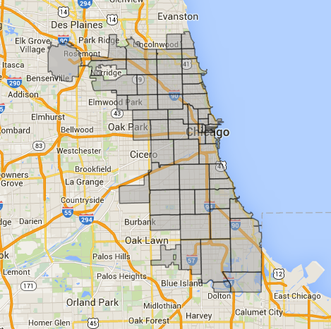
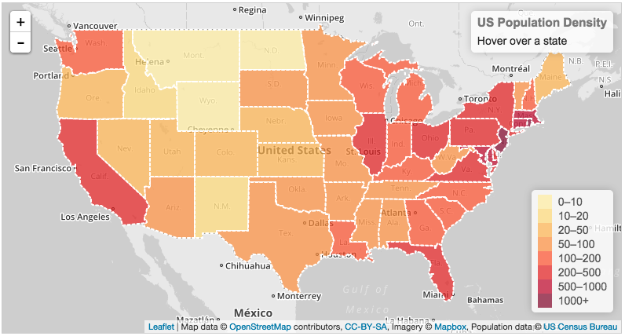
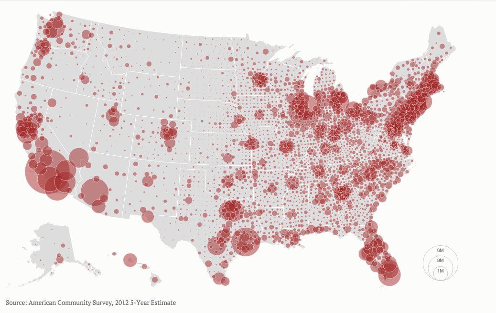
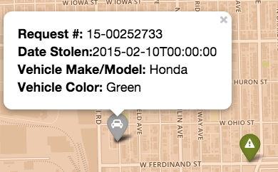
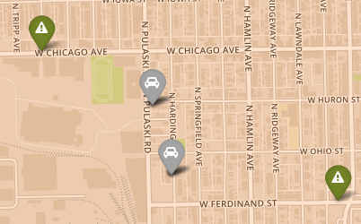

# MapView

### Web Technologies to be utilized:

For the map based API, we will use the following Javascript Libraries:

* [Javascript](https://developer.mozilla.org/en-US/docs/Web/JavaScript): The scripting language of the web
* [leafletjs](http://leafletjs.com/index.html): Powerful map based API, will drive the application
* [d3](http://d3js.org/): Figures and diagrams, should they be desired
* [mapbox](https://www.mapbox.com/): Source of google-maps-like maps. Lots and Lots of options I have a developer api key
* [GeoJson](http://geojson.org/): Data format for encoding geographic data structures
* [ogr2ogr](http://www.gdal.org/ogr2ogr.html): For converting GIS shapefiles to geojson format
* [topojson](https://github.com/mbostock/topojson): An extension of GeoJson which encodes topology, which may be useful
* [Python](https://www.python.org/): For data cleaning and preprocessing (if necessary)

### Data sources:
* [Chicago Data Portal](https://data.cityofchicago.org/): Contains a wealth of information about city services locations, community health centers, various census data stats.

---

I have already extracted location data (with meta info) on the following:

  * Community Service Centers
  * Libraries
  * Mental Health Clinics
  * Chicago Primary Care Community Health Centers
  * Neighborhood Health Clinics
  * Women and children health clinics
  * Sexually Transmitted Infections Health Clinics

---

* [2010 Illinois Zipcode boundaries](https://www.census.gov/cgi-bin/geo/shapefiles2010/layers.cgi): GIS shape files of 2010 Illinois Zipcode boundaries. From this data I can convert to GeoJson, then filter out only the ~250 zipcodes we have identified in order to ensure complete coverage.
* [jgoodall/us-maps](https://github.com/jgoodall/us-maps): This repository contains a wealth of information that could be of some use.

---
    
### Visualization Representation of Zipcode data:

* Zipcode boundary geo-information overlaid on top of a google-maps like. Think something  along these lines:

---

### Visualization Representation of Population Density within Zipcode boundaries

* Population densities will be best represented as a Choropleth map, or a Heatmap. Think something like this: 
* As an alternative, we could do something akin to this if you prefer that type of representation better: 
  * There are Costs and Benefits to both representations, of course. I think representing the data as a Choropleth will give us a good sense of which zones have the highest densities, without visually occluding other types of information such as Location markers for the various service types.

---

### Visual Representations of the Community services:
* Google maps style Markers (this is from an application I built last semester). We will have identifiable markers containing 'popup' tooltip windows containing anything from links to websites or other relevant meta information (addresses for example):  

